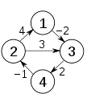

#  Floyds Algorigthm
###  Authors: *Christopher Perez* and *Thomas Malachi*

<br />
The Floyd-Warshall algorithm is an algorithm for finding the shortest paths from every point to another within in a weighted graph. This algorithm works upon the condition that the graph does not have any negative cycles. 

The algorithm results in a matrix representing the distance between each of the points. 

The Floyd Marshall algorithm falls under the category of the graph and tree search algorithms similar to others lke the Dikstra algorithm. 

As currently implemented this algorithm runs in O(n^3). 

The algorithm is implemented using dynamic programming.

## History
---
THe Floyd-Warshall algorithm was established in 1962 by Robert Floyd based on contributions from previous mathematicians like Stephen Warshall and Bernard Roy. 
<br />
<br />
<br />

## How it works
---
From an abstract perspective the algorithm works as follows:

The program takes a weighted graph that meets certain conditions as input. From here a series of matricies a generated where each subsquent matrix shows the distance every  node to the other with a certain intermidiary point, or none in the case of the first matrix(called the adjacency matrix). Moreover, as the new matricies are generated the previous matricies are taken into consideration when creating the new matrix using a different intermidiary point. 

In simpler words, the algorithm basically generates all possible possible path and the amount/cost/weight that each path is. After this 
the path with the smallest weigh is taken from one of the matricies for every single path. For instance, when looking for the smallest point from A to B, the algorithm will look at all the generated matricies and pick the path that has the smallest weight for the path that goes from A to B.  

Example:

*Given,*
<br />



<br />

*The generated matrcies will be*:


**Source**, [Wikipedia](https://en.wikipedia.org/wiki/Floyd%E2%80%93Warshall_algorithm)

*In the above example k represents the intermediary node. When k = 0, there is no intermidary node. If there is no path from arbitrary points A to B then it is represented as infinity.* 


### **Pseudocode**
```
let dist be a |V| × |V| array of minimum distances initialized to ∞ (infinity)
    for each edge (u, v) do
        dist[u][v] ← w(u, v)  // The weight of the edge (u, v)
    for each vertex v do
        dist[v][v] ← 0
    for k from 1 to |V|
        for i from 1 to |V|
            for j from 1 to |V|
                if dist[i][j] > dist[i][k] + dist[k][j] 
                    dist[i][j] ← dist[i][k] + dist[k][j]
                end if
```
**Source**, [Wikipedia](https://en.wikipedia.org/wiki/Floyd%E2%80%93Warshall_algorithm)


## Analysis
---

As mentioned, the algorithm aims to calculate the shortest path between to nodes in a weighted graph by generating the weights for all the possible paths between two nodes. From the algorithm choses the path with the least weight between arbitrary points A and B. 

If '*generating all the possible outcomes*' already sounded off some alarms as a programmer or mathematician then you're insticts are correct. 

This algorithm has a worst case run-time complexity of O(n^3). As it can be seen from the pseudocode, the program implements three loops nested within one another that each run for the number of nodes in the graph(or |V|). This essentially means that as the number of nodes(n) grows the number of computations the algorithm has to do increases at a cubic rate(n^3). Hence, this ultimately means that  the algorithm does not scale efficiently because of its very high computational costs.

## Code
---


*Note: Reader-Writer, Floyds-Algorithm are separte classes*


There are several classes and different data structures implemented in this program for the purposes of implementing code that follows solid programming principles. An important thing to note is that the diagram shown above is quite abstract and there are several things going on that are not illustrated in detail. 

### ***Design decisions***
---
One aspect of the diagram that is not self explanatory is the cleanData() function. 

The raw input has -1 representing infinity. This representation is then turned into 1e7, which is the highest integer value possible in Java. The adajency matrix is then given to the Floyd-Warshall class to perform the algorithm. Meanwhile the adjency matrix is also given to the cleanData() function to turn the 1e7 values into -1 once again and then place it in the output file. 

The question that arises from this functionality is why convert -1 to 1e7 for comparisons and then back again to -1? 

Although it is redundant this was an important design tradeoff decision that had to be made for the sake of speed. To further explain it is first important to remember that the algorithm runs in O(n^3).  Having infinity represented as -1 would mean more logic when comparing two elements which would massively compound in additional computation when running under a O(n^3) function.

Using -1:

- Use less space
- Makes code cleaner and less redundant because of having to convert infinity between -1 and 1e7 and back to -1.

Using 1e7:
- Less comparisons in calculateShortestPairs() <- runs in O(n^3)


Although redundant, representing infinity as 1e7 instead of -1 results in better computation time because of less operations. This difference cannot be observed in this small program but rather in larger ones.

<br />

Another important design decision was to consolidate the intermiadate matricies into its own data structure for managable access. Without this data struture the programmer would have to keep track and label each one of the matrices which would end up being messy and difficult to work which. Hence, all the intermidiary matricies are hidden behind a data structure called PairsMatricies(*not shown above*). 


<br />

### Below is a guide with code showing the implementation details of the critical functions,
<br />


## **FloydsAlgo.java**
---


<br />

## **ReaderWriter.java**
---


<br />

## **PairMatricies.java**
---


To view the whole code base please click [here](https://github.com/Chris0016/Floyds-Shortest-Path-Algorithm).


Thanks for reading. 